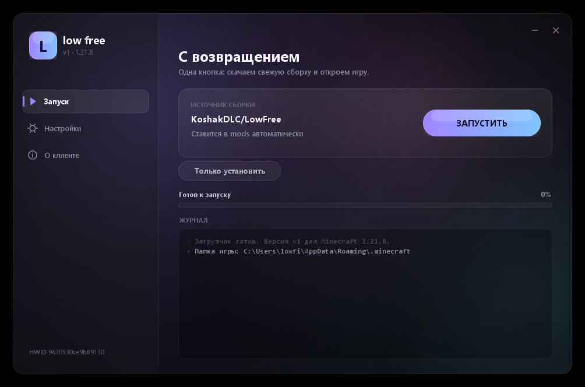

# low free — загрузчик

Десктопный лоадер клиента: сам берёт свежую сборку с GitHub, кладёт её в `mods` и открывает игру.
Настраивать пути не нужно — одна кнопка «Запустить».
Написан на чистой Java (Swing с полностью ручной отрисовкой), внешних зависимостей нет —
нужен только JDK 17 или новее, тот же, которым собирается сам клиент.



## Сборка и запуск

```bat
cd loader
build.bat        :: соберёт low-free-loader.jar
run.bat          :: соберёт, если нужно, и запустит
run.bat debug    :: то же, но с консолью — видно ошибки
```

Нужна **Java 17 или новее**. Скрипты не полагаются на `PATH`: `find-java.bat` перебирает
`JAVA_HOME`, `%USERPROFILE%\.jdks`, Program Files и только в конце `PATH`, проверяя версию
каждой найденной сборки.

> Запускай именно `run.bat`, а не двойной клик по `low-free-loader.jar`. В Windows jar-файлы
> обычно привязаны к старой Java 8, и она выдаёт «A Java Exception has occurred» вместо окна.

## Что делает при запуске

1. Находит папку игры (`%APPDATA%\.minecraft`) и создаёт в ней `mods`, если её нет.
2. Проверяет, установлен ли Fabric для 1.21.8.
3. Скачивает свежую сборку клиента из релизов GitHub.
4. Копирует джарник в `mods`, удаляя прошлые сборки `wild-*.jar`, и запускает игру.

Ключей и лицензий пока нет — загрузчик ничего не спрашивает.

## Откуда берётся сборка

По умолчанию — из релиза `latest` репозитория `KoshakDLC/LowFree`, который обновляет
GitHub Actions при каждом пуше в `main`. Загрузчик берёт из релиза первый `.jar`, пропуская
`-sources` и `-dev`.

Скачанное лежит в `%APPDATA%\low free\cache\<тег релиза>\`. Пока тег и размер файла совпадают
с релизом, повторной загрузки не будет — новый релиз скачается сам.

Источник можно переопределить, приоритет сверху вниз:

1. `client.jar` — путь к локальному джарнику, полностью отключает загрузку;
2. `client.url` — прямая ссылка на `.jar`;
3. `github.repo` — репозиторий в виде `владелец/имя`;
4. если ничего не вышло — локальная сборка из `build/libs` (запасной вариант для разработки).

## Настройки

Хранятся в `%APPDATA%\low free\loader.properties` и сохраняются сразу при изменении:

| Ключ | Смысл |
| --- | --- |
| `minecraft.dir` | папка игры; в интерфейсе не показана, пусто — `%APPDATA%\.minecraft` |
| `github.repo` | репозиторий со сборками, по умолчанию `KoshakDLC/LowFree` |
| `client.url` | прямая ссылка на джарник вместо релизов |
| `client.jar` | локальный джарник, отключает загрузку |
| `memory.gb` | выделяемая память |
| `launch.command` | своя команда запуска вместо поиска лаунчера |
| `auto.install` | обновлять клиент при запуске |
| `close.on.launch` | закрывать загрузчик после старта игры |

## Разработка

`tools/wild/loader/Preview.java` рендерит окно в PNG, чтобы смотреть на вёрстку без запуска:

```bat
javac -encoding UTF-8 -cp out -d out tools\wild\loader\Preview.java
java -cp out wild.loader.Preview preview.png 1
```

Второй аргумент — номер страницы (0 — «Запуск», 1 — «Настройки», 2 — «О клиенте»),
третий `busy` — состояние с прогрессом и заполненным журналом.

`tools/wild/loader/DownloadCheck.java` проверяет разбор релизов и саму загрузку:

```bat
java -cp out wild.loader.DownloadCheck KoshakDLC/LowFree
java -cp out wild.loader.DownloadCheck download KoshakDLC/LowFree
```
